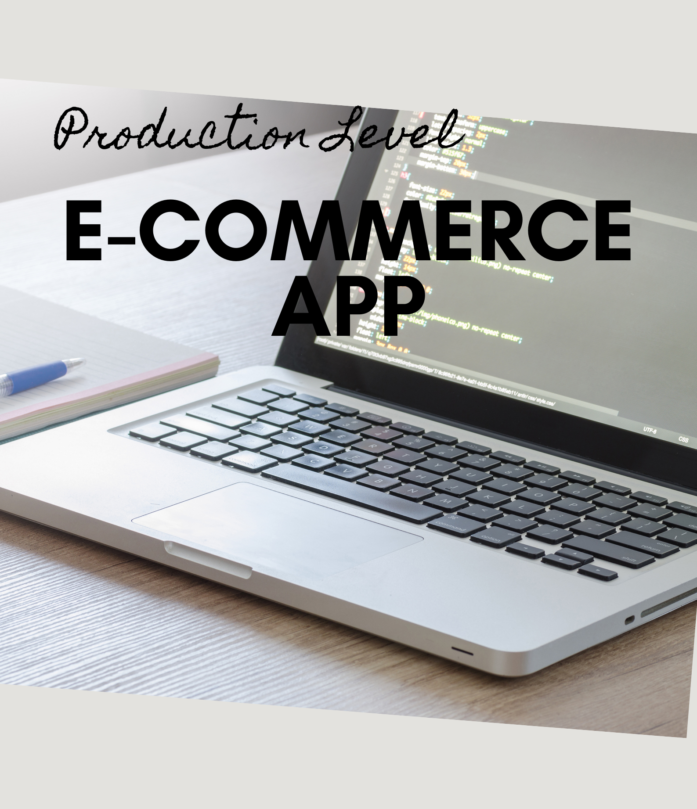
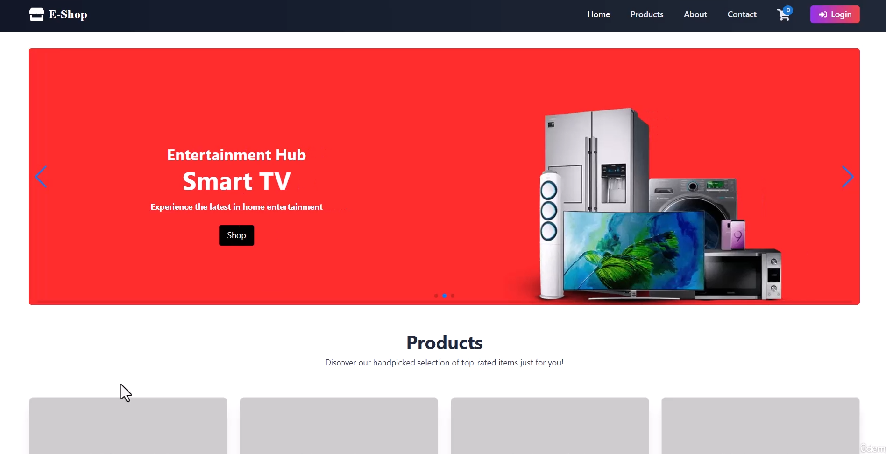
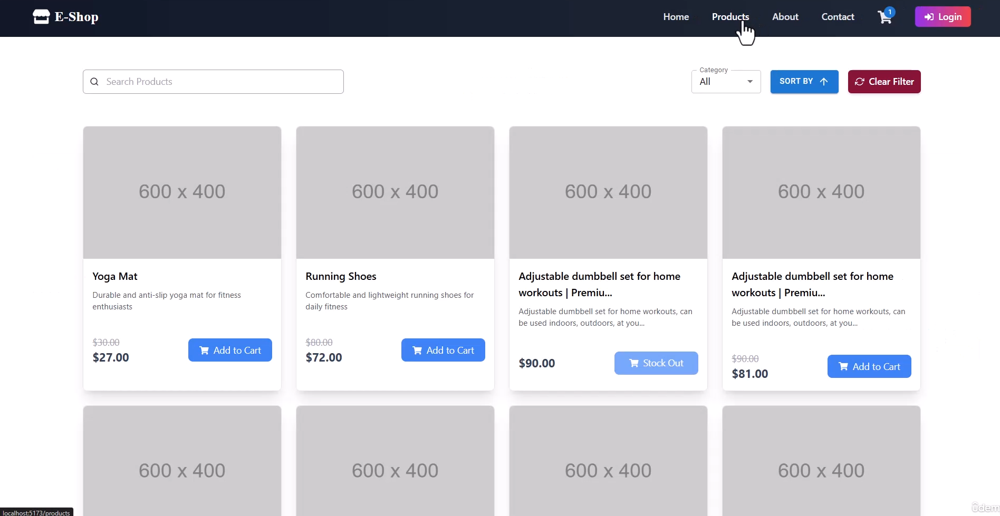
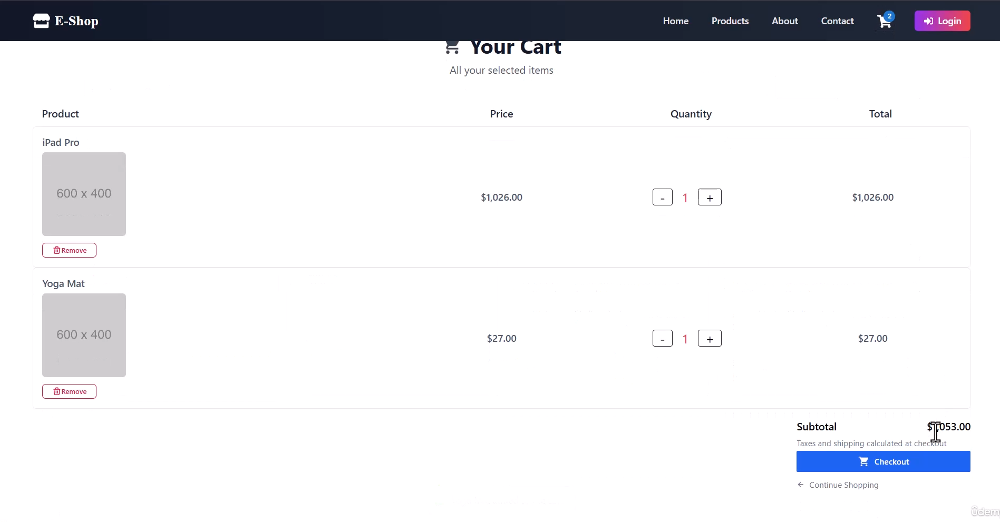
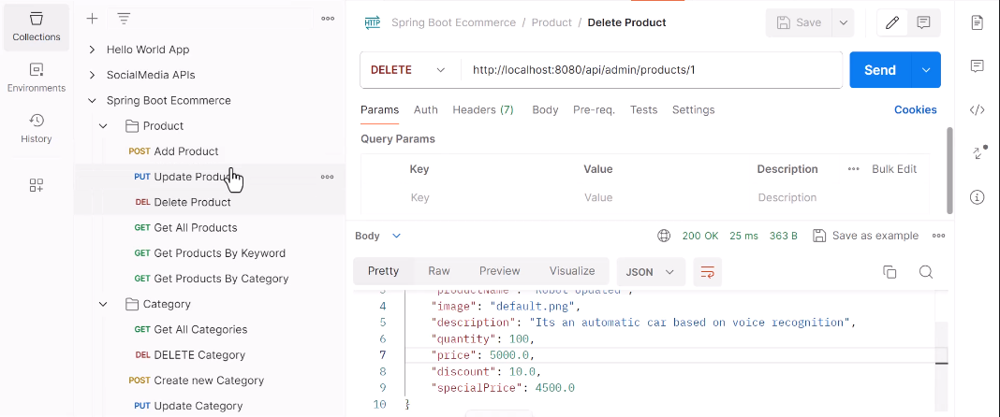

# Full Stack eCommerce App



## Table of Contents
- [Overview](#overview)
- [Key Concepts](#key-concepts)
- [Implementation Details](#implementation-details)
- [Results](#results)
- [Usage](#usage)
- [Acknowledgements](#acknowledgements)

## Overview

This repository contains a **Full Stack eCommerce Application** built with **Spring Boot** for the backend and **React** for the frontend. The project simulates a real-world eCommerce platform, incorporating features such as user authentication, order management, and secure deployment. The application is deployed using AWS services, ensuring scalability and reliability.

**Key Features:**
- Fully integrated backend and frontend.
- Secure authentication using JWT.
- Comprehensive eCommerce modules like product management, cart functionality, and order placement.
- Deployment-ready architecture leveraging AWS.

---

## Key Concepts

### Backend

1. **Spring Boot Framework**
   - Robust RESTful API development.
   - Integrated tools for database interaction and security.

2. **Database Management**
   - Persistent storage using PostgreSQL/MySQL.
   - Efficient database operations using JPA and Hibernate.

3. **Authentication & Authorization**
   - Role-based access control.
   - JWT for secure session management.

4. **E-commerce Modules**
   - Product and category management.
   - User roles and shopping cart functionality.

### Frontend

1. **React Framework**
   - Dynamic UI and state management.
   - Seamless navigation with React Router.

2. **Styling**
   - Tailwind CSS for modern and responsive designs.

3. **State Management**
   - Centralized state control using Redux.

---

## Implementation Details

### Backend
1. **Category Management**
   - Create, update, and delete categories.
   - Integrated API endpoints for seamless operations.

2. **Product Management**
   - Add, update, and delete products.
   - Fetch and display paginated product lists.

3. **User Authentication**
   - Custom login and registration flows.
   - JWT for secure session handling.

4. **Order and Payment**
   - Secure order placement.
   - Placeholder for payment gateway integration.

5. **Spring Security**
   - Secure endpoints with role-based access.

### Frontend
1. **Landing Page**
   - Highlight featured products dynamically.

2. **Shopping Cart**
   - Real-time updates on cart actions.
   - Smooth checkout experience.

3. **Authentication UI**
   - Registration, login, and session management.

4. **Product Listings**
   - Paginated product views with sorting filters.

---

## Results

This application demonstrates the seamless integration of backend and frontend components, delivering a feature-rich and user-friendly eCommerce platform. Below are some key screenshots:






---

## Usage

To set up and run the project locally:

### Prerequisites
- Java JDK 17 or later
- Node.js v16 or later
- PostgreSQL or MySQL database
- AWS account (optional for deployment)

### Steps

#### Backend
1. Clone the repository:
   ```plaintext
   git clone https://github.com/rujuldwivedi/full-stack-ecommerce-app.git
