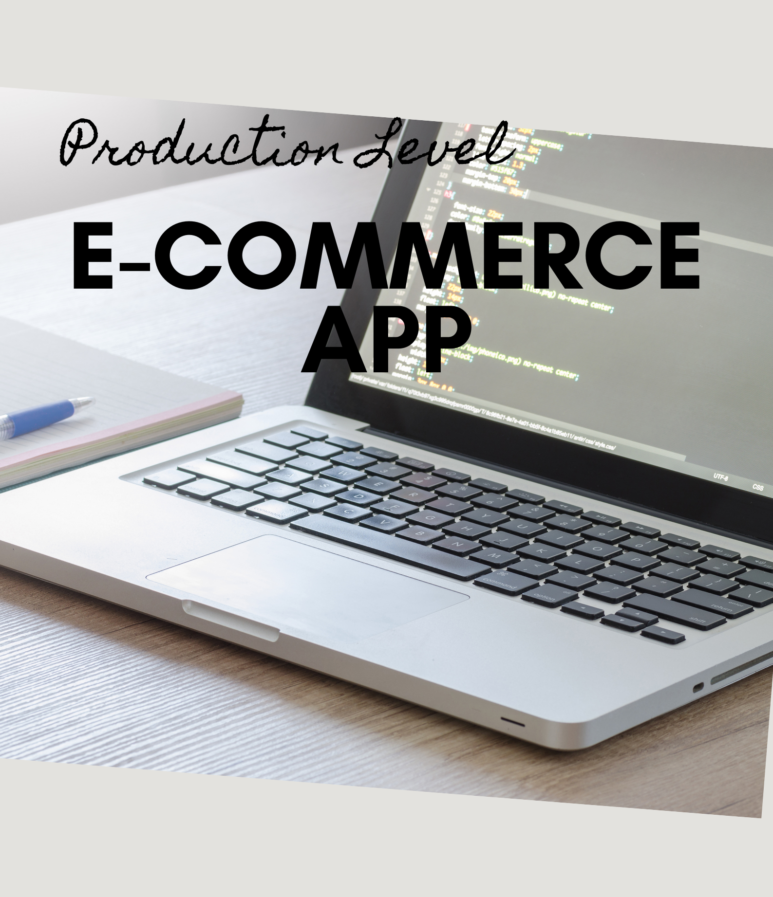

# Full Stack eCommerce App

## Overview
Welcome to the **Full Stack eCommerce Application** built using **Spring Boot** for the backend and **React** for the frontend. It leverages modern technologies and best practices to create a scalable, secure, and user-friendly application.

This project is the culmination of creating an application designed to cover all aspects of a real-world eCommerce system, from user authentication to order management and deployment.

---

## Features
### Backend
- **Spring Boot Framework**: Robust backend architecture with RESTful APIs.
- **Spring Security with JWT**: Secure authentication and authorization.
- **Database Integration**: Persistent data storage with **PostgreSQL** and **MySQL**.
- **JPA & Hibernate**: Efficient ORM for database operations.
- **Lombok Integration**: Reduced boilerplate code for enhanced productivity.
- **Custom Authentication**: Fine-tuned security mechanisms for user roles and permissions.
- **E-commerce Modules**: Comprehensive modules for categories, products, users, shopping cart, and orders.
- **Pagination & Sorting**: Optimized data display for large datasets.
- **Deployment on AWS**: Cloud-ready architecture with advanced deployment configurations.

### Frontend
- **React Framework**: Dynamic and responsive user interface.
- **React Hooks**: Advanced state and lifecycle management with hooks like `useState`, `useEffect`, and custom hooks.
- **React Router**: Seamless navigation and routing.
- **Redux**: Centralized state management for scalability.
- **Tailwind CSS**: Modern and customizable styling.
- **React Hook Forms**: Simplified and user-friendly form handling.

### Full Stack Integration
- Smooth communication between backend APIs and frontend UI.
- Unified data flow and error handling.
- Optimized deployment pipeline ensuring a consistent experience.

---

## Project Modules

### Backend Modules
1. **Category Management**: CRUD operations for product categories.
2. **Product Management**: Features to add, update, delete, and list products.
3. **User Management**: User profiles, roles, and custom authentication mechanisms.
4. **Shopping Cart**: Add, update, and manage cart items.
5. **Order & Payment**: Place and manage orders with secure payment handling.
6. **Spring Security**: Secure endpoints with role-based access control and JWT.

### Frontend Modules
1. **Landing Page**: Modern UI showcasing products.
2. **Product Listing**: Pagination and sorting for enhanced browsing.
3. **Shopping Cart UI**: Real-time cart updates and user-friendly interface.
4. **User Authentication**: Register, login, and manage user sessions.
5. **Checkout**: Streamlined process for placing orders.

---

## Tools & Technologies

### Backend
- Java
- Spring Framework
- Spring Boot
- Spring Security
- Spring Data JPA
- Hibernate
- PostgreSQL / MySQL
- Lombok
- JSON Web Tokens (JWT)

### Frontend
- React
- React Router
- Redux
- Tailwind CSS
- React Hook Forms

### Deployment
- AWS EC2 for hosting
- AWS RDS for database
- AWS S3 for static content

---

## Installation Guide
### Prerequisites
- **Java** (JDK 17 or later)
- **Node.js** (v16 or later)
- **PostgreSQL** or **MySQL** database
- AWS account (optional for deployment)

### Steps to Run Locally
1. Clone the repository:
   `git clone https://github.com/rujuldwivedi/full-stack-ecommerce-app.git`

2. Navigate to the project directory:
   `cd full-stack-ecommerce-app`

3. Set up the database:
   - Create a PostgreSQL or MySQL database.
   - Update database configurations in the `application.properties` file.

4. Build and run the backend:
   - Use your preferred IDE or the following command:
     `./mvnw spring-boot:run`

5. Navigate to the `frontend` directory and install dependencies:
   `cd frontend`
   `npm install`

6. Start the React development server:
   `npm start`

7. Access the application in your browser at:
   - `http://localhost:3000` for the frontend
   - `http://localhost:8080` for the backend

---

## Deployment Guide
1. **AWS Deployment**:
   - Deploy the Spring Boot backend on an AWS EC2 instance.
   - Use AWS RDS for database hosting.
   - Configure the S3 bucket for serving static content.
2. Update the `application.properties` file for production configurations.

---

## Key Learnings
- Mastery of Spring Framework and Spring Boot.
- Hands-on experience with React and modern frontend development.
- Integration of secure authentication and authorization mechanisms.
- End-to-end deployment pipeline using AWS.
- Practical understanding of database integration and management.

---

## Contributing
Contributions are welcome! Please fork the repository and submit a pull request for any improvements or bug fixes.

---

## Acknowledgments
- Special thanks to the instructors for providing comprehensive and hands-on training.
